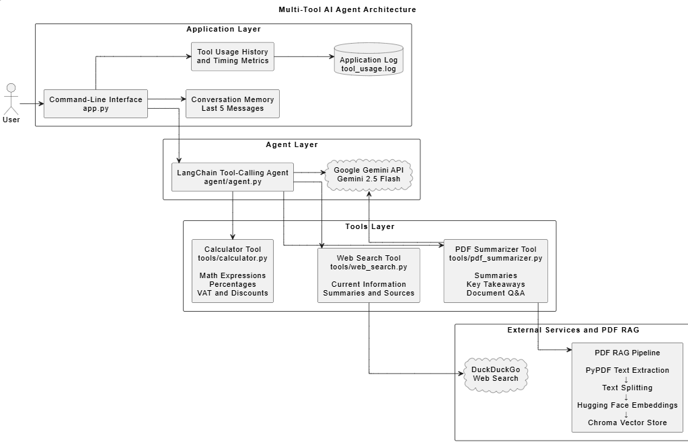

# Multi-Tool AI Agent

A command-line AI assistant built with Python and LangChain. The agent analyzes the user’s request, automatically selects the appropriate tool, and can use multiple tools in the same request when necessary.

The project was created for the **AI Intern – Week 3 Assignment** and focuses on:

* Tool creation
* Agent reasoning
* Tool routing
* Error handling
* Modular code organization
* Conversation memory
* Tool execution tracking

---

## Project Deliverables

### Source Code Repository

GitHub repository:

```text
[GitHub Repository](https://github.com/osamajahmad/Multi-tool-AI-agent-using-LangChain)
```

### Architecture Diagram

Architecture diagram:

```text

```

### Demo Video

Five-minute demonstration video:

```text
[Watch the Demo Video](https://youtu.be/nj5EwYUReVg)
```

---

## Features

The project includes three main tools:

1. Calculator Tool
2. Web Search Tool
3. PDF Summarizer Tool

The LangChain agent decides which tool to use based on the user’s request.

The agent can also combine multiple tools in one response.

Example:

```text
Search for the latest AI news and calculate 10% growth on a budget of 5000 AED.
```

For this request, the agent:

1. Uses the Web Search Tool to find current AI news.
2. Uses the Calculator Tool to calculate the budget growth.
3. Combines both results into one final answer.

---

## Tools

### 1. Calculator Tool

The Calculator Tool handles common mathematical requests.

It supports:

* Addition
* Subtraction
* Multiplication
* Division
* Percentages
* VAT calculations
* Discounts
* Monthly-payment calculations
* Simple mathematical expressions
* Brackets
* Decimal values
* Negative values

Example questions:

```text
What is 125 * 42?
```

```text
Calculate 15% VAT on 250 AED.
```

```text
Calculate monthly payment for 5000 divided by 12.
```

```text
What is 10% of 10?
```

```text
Calculate a 20% discount on 300 AED.
```

The calculator also handles errors such as invalid expressions and division by zero.

---

### 2. Web Search Tool

The Web Search Tool uses DuckDuckGo to search for current information.

It returns:

* A concise summary of the search results
* Source titles
* Source links

Example questions:

```text
Latest AI news
```

```text
What is LangChain?
```

```text
Recent developments in large language models
```

```text
What are the latest developments in generative AI?
```

The Web Search Tool is useful when the user asks about recent information that may not be available in the language model’s existing knowledge.

Internet access is required for this tool.

---

### 3. PDF Summarizer Tool

The PDF Summarizer Tool can:

* Extract text from a PDF
* Generate a document summary
* List key takeaways
* Answer questions about the document
* Search for specific information inside the PDF

The default PDF is stored at:

```text
data/AI_and_Future_Jobs_20_Page_Report.pdf
```

If the user does not select another PDF, the application continues using this default document.

The user can also select another PDF by entering:

```text
pdf
```

and then providing the full path of the PDF file.

Example:

```text
C:\Users\User\Documents\report.pdf
```

After selecting the file, the PDF tool uses the newly selected PDF for summaries and questions.

Example questions:

```text
Summarize this PDF.
```

```text
What are the key points?
```

```text
What are the main takeaways?
```

```text
What does the document say about security?
```

```text
What jobs are discussed in the document?
```

The PDF must contain selectable text. Scanned image-only PDFs are not supported because OCR is not included.

---

## PDF RAG Workflow

The PDF tool uses Retrieval-Augmented Generation, also known as RAG.

The workflow is:

1. Read and extract text from the PDF.
2. Split the extracted text into smaller chunks.
3. Convert the chunks into embeddings.
4. Store the embeddings in a Chroma vector store.
5. Search for the chunks most relevant to the user’s question.
6. Send the relevant context to Gemini.
7. Generate an answer based only on the PDF content.

For full-document requests such as summaries or key takeaways, the tool uses the complete extracted document text.

For specific questions, it retrieves the most relevant chunks using similarity search.

The embedding model used is:

```text
sentence-transformers/all-MiniLM-L6-v2
```

---

## Agent Logic

The agent is responsible for understanding the request and selecting the correct tool.

Examples:

| User request                                    | Tool selected                   |
| ----------------------------------------------- | ------------------------------- |
| `What is 125 * 42?`                             | Calculator Tool                 |
| `What is the latest AI news?`                   | Web Search Tool                 |
| `Summarize this PDF.`                           | PDF Summarizer Tool             |
| `Search for AI news and calculate 10% of 5000.` | Web Search and Calculator Tools |

The agent can answer general questions directly when no external tool is needed.

The agent prompt contains instructions that help it:

* Choose the correct tool
* Use multiple tools when required
* Avoid unnecessary tool calls
* Return a clear final response
* Handle tool failures gracefully

---

## LLM Provider

The project uses:

```text
Google Gemini 2.5 Flash
```

The assignment originally mentions the OpenAI API. Gemini was used because it provides a suitable free-tier option for development and testing.

The Gemini model is connected through:

```text
langchain-google-genai
```

The project structure allows the language model provider to be changed later without rewriting the individual tools.

The model temperature is set to:

```text
0.3
```

This helps produce responses that are clear and consistent while still allowing some flexibility.

---

## Bonus Features

The assignment requires any two bonus features. This project includes three.

### 1. Conversation Memory

The application stores the latest five conversation messages.

This allows the user to ask follow-up questions.

Example:

```text
You: Calculate 15% of 500.
```

Then:

```text
You: Add that result to the original amount.
```

The memory is limited to five messages so that the conversation history does not grow continuously.

The memory resets when the application is closed.

---

### 2. Tool Usage History

The application records the tools used during the current session.

Enter:

```text
history
```

to view the history.

Example output:

```text
Request 1
Question: What is 125 * 42?
Tool: calculator_tool
Status: Success
Execution time: 0.01 seconds
```

The history includes:

* User question
* Tool name
* Tool status
* Execution time

---

### 3. Tool Execution Timing Metrics

LangChain callbacks are used to measure how long each tool takes to complete.

Example:

```text
Tool: web_search_tool
Status: Success
Execution time: 2.41 seconds
```

This helps monitor tool performance and identify slow operations.

---

## Logging

Tool activity and application errors are stored in:

```text
tool_usage.log
```

The log file is created automatically when the application runs.

The log can include:

* User questions
* Tool names
* Tool status
* Execution time
* Agent errors
* Application errors

The log file should not be uploaded if it contains unnecessary local testing information.

---

## Project Structure

```text
Task 3/
│
├── agent/
│   └── agent.py
│
├── tools/
│   ├── calculator.py
│   ├── web_search.py
│   └── pdf_summarizer.py
│
├── data/
│   └── AI_and_Future_Jobs_20_Page_Report.pdf
│
├── app.py
├── requirements.txt
├── README.md
├── .env.example
└── .gitignore
```

### File Responsibilities

#### `app.py`

The main command-line application.

It is responsible for:

* Starting the program
* Reading user input
* Displaying the agent response
* Managing conversation memory
* Recording tool history
* Measuring tool execution time
* Writing activity to the log file
* Handling commands such as `history`, `pdf`, `exit`, and `quit`

#### `agent/agent.py`

Creates and configures the LangChain agent.

It is responsible for:

* Initializing Gemini
* Registering the available tools
* Defining the agent instructions
* Creating the tool-calling agent
* Creating the `AgentExecutor`

#### `tools/calculator.py`

Contains the calculator logic and calculator LangChain tool.

#### `tools/web_search.py`

Contains the DuckDuckGo search logic and web-search LangChain tool.

#### `tools/pdf_summarizer.py`

Contains:

* PDF text extraction
* Text splitting
* Embedding creation
* Chroma vector storage
* Similarity search
* PDF summarization
* PDF question answering

#### `data/`

Contains the default PDF used by the application.

#### `.env.example`

Shows the required environment-variable format without containing a real API key.

#### `.gitignore`

Prevents private or unnecessary files from being uploaded, including:

* `.env`
* `.venv`
* `__pycache__`
* Python cache files
* Log files
* Chroma database files

---

## Requirements

The project requires:

* Python
* LangChain
* Google Gemini API
* DuckDuckGo Search
* PyPDF
* Chroma
* Hugging Face sentence-transformer embeddings
* Python Dotenv

A valid Gemini API key and internet connection are required.

---

## Setup Instructions

### 1. Download or clone the project

Using Git:

```bash
git clone https://github.com/osamajahmad/Multi-tool-AI-agent-using-LangChain
```

Then open the project folder:

```bash
cd Multi-tool-AI-agent-using-LangChain
```

The exact folder name may be different depending on the repository name.

---

### 2. Create a virtual environment

Run:

```bash
python -m venv .venv
```

Activate it on Windows:

```bash
.venv\Scripts\activate
```

Activate it on macOS or Linux:

```bash
source .venv/bin/activate
```

---

### 3. Install the dependencies

Run:

```bash
pip install -r requirements.txt
```

The first time the PDF tool runs, the Hugging Face embedding model may need to be downloaded.

---

### 4. Configure the Gemini API key

Create a file named:

```text
.env
```

inside the main project folder.

Add:

```env
GOOGLE_API_KEY=your_google_api_key_here
```

The project also includes `.env.example` as a template.

Do not upload the real `.env` file to GitHub or include it in the submission ZIP.

---

### 5. Check the default PDF

The default PDF should be located at:

```text
data/AI_and_Future_Jobs_20_Page_Report.pdf
```

The application uses this PDF unless the user selects another document.

---

## Running the Application

Run:

```bash
python app.py
```

The command-line interface will display:

* Available tools
* Available commands
* Example questions

Example interaction:

```text
You: Calculate 15% VAT on 250 AED.
```

The agent selects the Calculator Tool and returns the VAT amount and final total.

---

## Application Commands

### View tool history

```text
history
```

Displays the tools used during the current session.

### Select another PDF

```text
pdf
```

The application then asks for the full path of the PDF.

### Stop the application

```text
exit
```

or:

```text
quit
```

---

## Suggested Test Cases

### Calculator Tests

```text
What is 125 * 42?
```

Expected calculation:

```text
5250
```

```text
Calculate 15% VAT on 250 AED.
```

Expected VAT:

```text
37.5 AED
```

Expected total:

```text
287.5 AED
```

```text
Calculate monthly payment for 5000 divided by 12.
```

Expected result:

```text
416.6667
```

```text
What is 10% of 10?
```

Expected result:

```text
1
```

```text
Calculate 10 divided by 0.
```

Expected result:

```text
A division-by-zero error message
```

---

### Web Search Tests

```text
What is LangChain?
```

```text
What is the latest AI news?
```

```text
What are the recent developments in LLMs?
```

The response should include a summary and source links.

---

### PDF Tests

```text
Summarize this PDF.
```

```text
What are the key points?
```

```text
What does the document say about security?
```

```text
What does the document say about future jobs?
```

The response should be based on the PDF content.

---

### Multi-Tool Test

```text
Search for the latest AI news and calculate 10% growth on a budget of 5000 AED.
```

The agent should use:

1. Web Search Tool
2. Calculator Tool

It should then combine both results into one response.

---

### Conversation Memory Test

First ask:

```text
Calculate 15% of 500.
```

Then ask:

```text
Add that result to the original amount.
```

The agent should use the recent conversation context.

---

### Invalid Input Tests

```text
Calculate 10 divided by 0.
```

```text
Summarize a PDF that does not exist.
```

```text
Search the web without an internet connection.
```

The application should return a clear error message instead of stopping unexpectedly.

---

## Error Handling

The project handles common errors such as:

* Empty user input
* Invalid mathematical expressions
* Division by zero
* Missing Gemini API key
* Invalid PDF paths
* Missing PDF files
* Non-PDF file selection
* PDFs with no extractable text
* Web-search failures
* Internet-connection problems
* Agent initialization errors
* Tool execution errors
* Unexpected application errors

The tools return clear messages so the user can understand what went wrong.

---

## Architecture Overview

The project follows a modular architecture.

```text
User
  │
  ▼
Command-Line Interface
app.py
  │
  ├── Conversation Memory
  ├── Tool Usage History
  ├── Timing Metrics
  └── Logging
  │
  ▼
LangChain Agent
agent/agent.py
  │
  ▼
Gemini 2.5 Flash
  │
  ├── Calculator Tool
  ├── Web Search Tool
  └── PDF Summarizer Tool
          │
          ├── PyPDF
          ├── Text Splitter
          ├── Hugging Face Embeddings
          ├── Chroma Vector Store
          └── Gemini Response Generation
```

The full architecture diagram is available here:

```text

```

---

## Challenges and Lessons Learned

### Challenges

#### 1. Choosing the Correct Tool

One of the main challenges was making sure the agent selected the correct tool based on the user’s request.

Some requests were simple and required only one tool, while others required multiple tools. For example, a request could ask the agent to search for current AI news and also perform a calculation.

To improve tool selection, I wrote clear descriptions for each tool and added instructions to the agent prompt explaining when each tool should be used.

---

#### 2. Handling Multi-Tool Requests

The agent needed to complete requests that required more than one tool and then combine the results into one clear answer.

For example:

```text
Search for the latest AI news and calculate 10% growth on a budget of 5000 AED.
```

The agent had to:

1. Use the Web Search Tool.
2. Use the Calculator Tool.
3. Combine both results into one final response.

This required testing the agent instructions and making sure the tools returned results in a format the agent could understand.

---

#### 3. Building the PDF Summarizer

The PDF Summarizer was the most challenging tool because the document could contain a large amount of text.

Sending the full PDF directly to the language model for every question would be inefficient. To solve this, I used a Retrieval-Augmented Generation workflow.

The PDF text is:

1. Extracted using PyPDF.
2. Divided into smaller chunks.
3. Converted into embeddings.
4. Stored in a Chroma vector store.
5. Searched to find the sections most relevant to the user’s question.

This allows the agent to answer questions using relevant parts of the document instead of processing the entire PDF every time.

---

#### 4. Working with Current Information

The language model may not always contain the latest information.

The Web Search Tool was added to retrieve current information using DuckDuckGo. The tool also returns source links so the user can check where the information came from.

A challenge was making sure the search output remained clear and concise while still including useful sources.

---

#### 5. Handling Invalid Inputs and Tool Failures

The application needed to continue running even when the user entered invalid input or when a tool failed.

Examples included:

* Division by zero
* Invalid mathematical expressions
* Missing PDF files
* PDFs with no extractable text
* Empty user input
* Web-search connection problems
* Missing or exhausted API keys

I added error handling so these problems return understandable messages instead of stopping the whole application.

---

#### 6. Tracking Tool Execution

I used LangChain callbacks to record which tools were called and how long each tool took to complete.

This was challenging because the callback needed to track each tool separately and connect the start and end times of the same execution.

The collected information is displayed in the tool-usage history and written to the log file.

---

#### 7. API Usage Limits

During testing, the Gemini API key sometimes reached its free-tier request limit.

This made repeated testing slower because I occasionally needed to wait before sending another request.

This taught me the importance of monitoring API usage, avoiding unnecessary model calls, and handling API-limit errors clearly.

---

### Lessons Learned

During this assignment, I learned how to:

* Create custom tools using LangChain.
* Connect multiple tools to one AI agent.
* Write clear tool descriptions that improve tool routing.
* Allow an agent to use more than one tool for a single request.
* Use Gemini as the language model through LangChain.
* Create a command-line interface for an AI application.
* Store API keys securely using environment variables.
* Handle invalid inputs and tool errors without stopping the application.
* Add conversation memory for follow-up questions.
* Limit conversation history to the most recent messages.
* Use LangChain callbacks to track tool execution.
* Measure and log tool execution time.
* Search the web for current information.
* Return source links with web-search results.
* Extract text from PDF documents.
* Split large documents into smaller chunks.
* Create embeddings using a sentence-transformer model.
* Store document embeddings in Chroma.
* Retrieve relevant PDF content using similarity search.
* Build a Retrieval-Augmented Generation workflow.
* Organize a Python project into separate tools, agent, and application files.
* Test individual tools and multi-tool requests.
* Write setup instructions and project documentation.

Overall, this assignment helped me understand how an AI agent can reason about a user’s request, choose the correct tools, handle errors, and combine different tool results into one useful response.


## Security Notes

The real API key must only be stored in:

```text
.env
```

The following files and folders should not be uploaded:

```text
.env
.venv/
__pycache__/
*.pyc
tool_usage.log
chroma_db/
```

Only `.env.example` should be included in the repository.

Example:

```env
GOOGLE_API_KEY=your_google_api_key_here
```

---

## Demo Video

The five-minute demo shows:

* Project structure
* Application startup
* Calculator Tool
* Web Search Tool
* PDF Summarizer Tool
* Multi-tool request
* Conversation memory
* Tool usage history
* Execution timing
* Error handling

Demo video link:

```text
[Watch the Demo Video](https://youtu.be/nj5EwYUReVg)
```

---

## Author

**Osama Jameel Ahmad**

AI Intern – Week 3 Assignment
